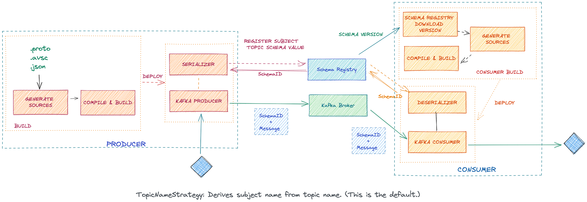
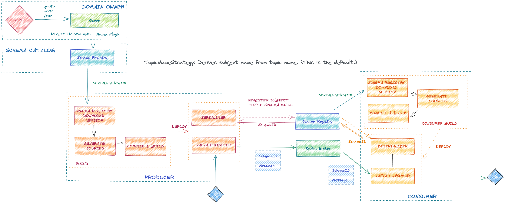
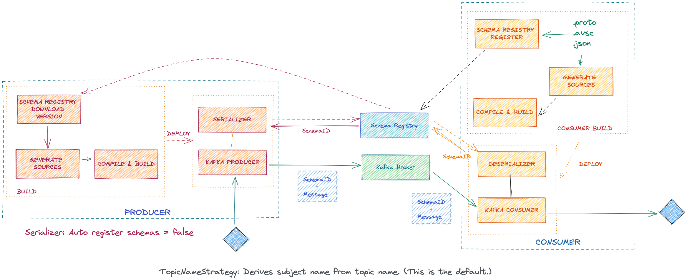
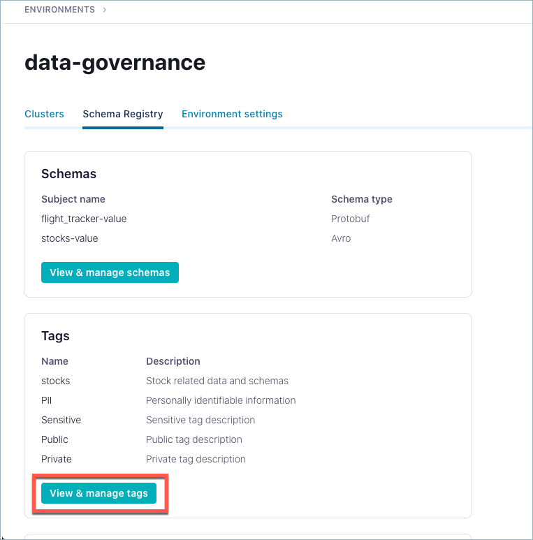

# Schema Regsitry Notes

## Why Schema Registry?

> A key requirement of our centralised event streaming platform is resilience and one step towards achieving this is providing guarantees about the structure of messages and data types within those messages. These guarantees mean consumer applications can have expectations of the format of the data and be less vulnerable to breaking due to corrupt messages.

[More](https://www.confluent.io/blog/schema-registry-kafka-stream-processing-yes-virginia-you-really-need-one)
and [More](https://www.confluent.io/blog/improving-stream-data-quality-with-protobuf-schema-validation/)

 
## Which Schema format to choose? 

[Apache Avro](https://avro.apache.org/) vs [Protocol Buffers](https://developers.google.com/protocol-buffers/) vs 
[JSON Schema](https://json-schema.org/)

All three provide efficient, cross-language serialization of data using a schema, and code generation for almost any programming language.

Kafka serializers and deserializers are available for Protobuf and JSON Schema, along with Avro. The serializers can automatically register schemas when serializing a Protobuf message or a JSON-serializable object. The Protobuf serializer can recursively register all imported schemas.

Schema Registry supports multiple formats at the same time.

[More](https://mikemybytes.com/2022/07/11/json-kafka-and-the-need-for-schema/)

### Serdes

| Format |	Producer |	Consumer |
| ------ | ------ | ------ |
| Avro	| io.confluent.kafka.serializers.KafkaAvroSerializer | 	io.confluent.kafka.serializers.KafkaAvroDeserializer |
| ProtoBuf	| io.confluent.kafka.serializers.protobuf.KafkaProtobufSerializer |	io.confluent.kafka.serializers.protobuf.KafkaProtobufDeserializer |
| JSON Schema |	io.confluent.kafka.serializers.json.KafkaJsonSchemaSerializer |	io.confluent.kafka.serializers.json.KafkaJsonSchemaDeserializer |

[More...](https://docs.confluent.io/platform/current/schema-registry/serdes-develop/index.html#supported-formats)


### AVRO 

[Apache Avro](https://avro.apache.org/) is a data serialization project that provides schemas with rich data structures, compressible file formats, and simple integration with many programming languages. 

* It has a direct mapping to and from JSON

* It has a very compact format. The bulk of JSON, repeating every field name with every single record, is what makes JSON inefficient for high-volume usage.

* It is very fast.

* It has great bindings for a wide variety of programming languages so you can generate Java objects that make working with event data easier, but it does not require code generation so tools can be written generically for any data stream.

* It has a rich, extensible schema language defined in pure JSON

* It has the best notion of compatibility for evolving your data over time.

* Avro should not be used if your objects are small. But it looks interesting for its speed if you have very big objects and don’t have complex data structures as they are difficult to express

[More](https://www.confluent.io/blog/avro-kafka-data/)

### Protobuf

[Protocol Buffers](https://developers.google.com/protocol-buffers/) open-sourced by Google

* Flexible data representation

### JSON Schema 
[JSON Schema](https://json-schema.org/)

* Very verbose and redundant 


[More...](https://www.confluent.io/blog/improving-stream-data-quality-with-protobuf-schema-validation/)

## Why Schema evolution?

> *As long as the changes don't break the compatibility, they can be introduced immediately.* 

This is especially important for distributed systems being built by multiple teams. It can reduce the burden of communication and the need for synchronization. In other words, schema evolution allows making compatible changes between incompatible versions.

Schema compatibility checking is implemented in Schema Registry by versioning every single schema. 

The compatibility type determines how Schema Registry compares the new schema with previous versions of a schema, for a given subject. 

When a schema is first created for a subject, it gets a unique id and it gets a version number, i.e., version 1. When the schema is updated (if it passes compatibility checks), it gets a new unique id and it gets an incremented version number, i.e., version 2.

Schema Registry default compatibility mode is ```BACKWARD```, it means that consumers using the new schema can read data produced with the last schema.

An example of a backward compatible change is a removal of a field. A consumer that was developed to process events without this field will be able to process events written with the old schema and contain the field – the consumer will just ignore that field.

```FORWARD``` compatibility means that data produced with a new schema can be read by consumers using the last schema, even though they may not be able to use the full capabilities of the new schema.

```FULL``` compatibility means schemas are both backward and forward compatible.

JSON Schema does not explicitly define compatibility rules. [More](https://yokota.blog/2021/03/29/understanding-json-schema-compatibility) 

[More...](https://docs.confluent.io/platform/current/schema-registry/avro.html#schema-evolution-and-compatibility)
and [More...](https://www.confluent.io/blog/schemas-contracts-compatibility/)

TRANSITIVE!! -----> TODO!

## Which Subject Naming Strategy to choose?

|  Subject Naming Strategy | Description |
| ----------------------- | ----------- |
| **TopicNameStrategy** |	Derives subject name from topic name. (This is the default.) |
| **RecordNameStrategy** |	Derives subject name from record name, and provides a way to group logically related events that may have different data structures under a subject. |
| **TopicRecordNameStrategy** |	Derives the subject name from topic and record name, as a way to group logically related events that may have different data structures under a subject. |

* ```TopicNameStrategy```: This is a good strategy for scenarios where grouping messages by topic name makes sense, such as aggregating logged activities or stream processing website comment threads. 

* ```RecordNameStrategy``` and ```TopicRecordNameStrategy```: a single topic can have records that use multiple schemas. This is useful when your data represents a time-ordered sequence of events, and the messages have different data

When using ```RecordNameStrategy``` with Protobuf and JSON Schema, there is additional configuration that is required.

A serializer registers a schema in Schema Registry under a subject name, which defines a namespace in the registry:

* Compatibility checks are per subject
* Versions are tied to subjects
* When schemas evolve, they are still associated to the same subject but get a new ```schema ID``` and version

[More...](https://docs.confluent.io/platform/current/schema-registry/serdes-develop/index.html)

## Should I need to Normalize Schemas? 

Minor formatting of the schema string representation is performed when is registered.

Two schemas that are semantically equivalent may be considered different from the perspective of Schema Registry.

If semantic equivalence is desired, the client can ask Schema Registry to normalize the schema during registration or lookup.

Some of the syntactic differences that are handled by normalization include the following:

* The ordering of properties in Avro and JSON Schema

* The ordering of imports and options in Protobuf

* The ordering of schema references

* Non-qualified names vs. fully-qualified names

[More...](https://docs.confluent.io/platform/current/schema-registry/serdes-develop/index.html#schema-normalization)


## Which tools should I use?

### Confluent CLI 

Manage Schema Registry via the Confluent CLI.

[Confluent CLI](https://docs.confluent.io/confluent-cli/current/command-reference/schema-registry/index.html#confluent-schema-registry)

### Schema Registry API 

Build a client for the Schema Registry REST API.

[Schema Registry API](https://docs.confluent.io/platform/current/schema-registry/develop/api.html)

### Maven Plugin

A Maven plugin for Confluent Schema Registry is available to help throughout the development process, including:

* Validate

* Validate-Local

* Register

* Download

[More](https://docs.confluent.io/platform/current/schema-registry/develop/maven-plugin.html#sr-maven-plugin)

## Who is the Schema Owner?  

### Producer 

The default configuration, with ```TopicNameStrategy``` and for the Serializers and Deserializers, is that the schema is registered by the producer. That means that it becomes the *schema owner* in some way. 

The serializers and Kafka Connect converters for all supported schema formats automatically register schemas by default. The Protobuf serializer recursively registers all referenced schemas separately.



### Schema Catalog 

The benefit of using a centralized repository of data models is to ensure good data quality across all inter-service communication because the rules are defined once and used consistently

> The Data Engineering team developed unit tests to enforce the rules, which run on every commit, and allow other developers to make changes to their models without needing to keep the rules at the front of their minds.

[More...](https://www.confluent.io/blog/improving-stream-data-quality-with-protobuf-schema-validation/)



 
### Consumer 

In some scenarios the Consumer could be the schema owner, such as when the schema is provided by a third-party. In that cases the consumer can register the schema with the Schema Registry, and the producers must use the same schema, disabling the auto schema registration. 


 
## Self Managed - Bad Practices

* Co-locating Schema Registry instances on Apache Kafka® brokers
* Creating separate Schema Registry instances within a company
* Incorrectly setting up Schema Registry in multi-datacenter deployments
* Not deploying a virtual IP (VIP) in front of multiple Schema Registry instances
* Configuring different names for the schemas topic in different Schema Registry instances
* Mixing the election modes among the Schema Registry instances in the same cluster
* Configuring different settings between Schema Registry instances that should be the same
* Configuring the same ```host.name``` for all Schema Registry instances
* Bringing up Schema Registry without any security features enabled
* Mis-configuring SSL keys, certificates, keystores, or truststores
* Manually creating the schemas topic with incorrect configuration settings
* Deleting the schemas topic from the Kafka cluster
* Not backing up the schemas topic
* Restarting Schema Registry instances before restoring the schemas topic
* Not monitoring Schema Registry
* Upgrading Java on the host machine to a version that is not compatible with Schema Registry
* Poorly managing a Kafka cluster that causes broker problems

[More](https://www.confluent.io/blog/17-ways-to-mess-up-self-managed-schema-registry/)

 
## Confluent Cloud Schema Registry

* Your VPC must be able to communicate with the Confluent Cloud Schema Registry public internet endpoint. 

* Schema Registry by Environment 

* To use Confluent Cloud Schema Registry for managing Kafka clusters, you need an API key specific to Schema Registry

* Schema Registry in Confluent Cloud [limits](https://docs.confluent.io/platform/current/schema-registry/develop/api.html#maximum-schemas-limit) the number of schema versions supported in the registry for basic clusters, standard clusters, and dedicated clusters as described in [Confluent Cloud Cluster Types](https://docs.confluent.io/cloud/current/clusters/cluster-types.html).

[Schema Management on Confluent Cloud](https://docs.confluent.io/cloud/current/get-started/schema-registry.html)

[Compare Schema Versions](https://docs.confluent.io/cloud/current/sr/schemas-manage.html#cloud-schema-compare-versions)

[VPC-peered environment](https://docs.confluent.io/cloud/current/networking/peering/schema-registry-vpc.html)

### Broker-side Schema Validation

You can enable Schema Validation per topic to have the broker verify whether data produced to that topic is using a valid schema ID. **Schema Validation is available only on Confluent Cloud dedicated clusters.**

[More](https://docs.confluent.io/cloud/current/sr/broker-side-schema-validation.html#cloud-schema-validation)

### Stream Catalog 

Stream catalog features enables entity tagging.

* Create instances of provided tags (Public, Private, Sensitive, PII) and custom (“free form”) tags

* Associate **tags** with schema versions, records, and fields

* Apply multiple tags to a single field, record, or schema version

When you apply tags, you always apply them to a particular version of a schema. As you modify schemas, they evolve to newer versions. Tags that you applied to previous versions of a schema are automatically propagated to new versions.



[Tagging](https://docs.confluent.io/cloud/current/stream-governance/stream-catalog.html#data-discovery-tagging)

[Data Discovery Search](https://docs.confluent.io/cloud/current/stream-governance/stream-catalog.html#data-discovery-search) 

[Stream Catalog REST API](https://docs.confluent.io/cloud/current/stream-governance/stream-catalog-rest-apis.html#stream-catalog-rest-apis)

[API](https://docs.confluent.io/cloud/current/api.html#tag/Entity-(v1))

[More](https://docs.confluent.io/cloud/current/stream-governance/stream-catalog.html#data-discovery-tagging)


## Schema Linking  

Schema Linking keeps schemas in sync across two Schema Registry clusters. Schema Linking can be used in conjunction with Cluster Linking to keep both schemas and topic data in sync across two Schema Registry and Kafka clusters.

[More](https://docs.confluent.io/cloud/current/sr/schema-linking.html#schema-linking)